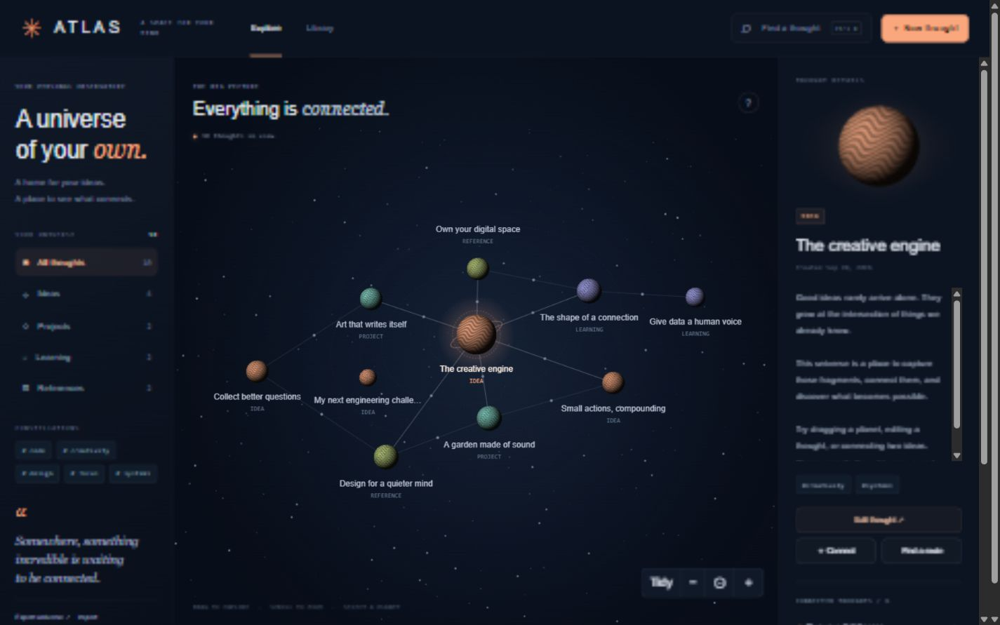

# Atlas — a universe of your own

A visual knowledge workspace where thoughts become planets and connections become constellations. Built with an original procedural Canvas renderer, a Node.js HTTP API, and SQLite persistence.



## Run

Use **Node.js 24 LTS** (minimum 22.13). No dependencies, API keys, or package installation are needed.

```sh
npm start
```

Open **http://localhost:3200**. Your notes are saved in `data/atlas.sqlite`, which is excluded from Git. The server listens only on your computer. Stop it with Ctrl+C.

### Instant preview

Open `public/index.html` in a browser or place that file on a static host. Its CSS and JavaScript are embedded. When the local API is unavailable, the preview uses a separate browser-storage workspace and labels itself **Preview**. It starts with nine editable sample thoughts.

The full application and preview are separate stores. Export from one and import into the other to transfer notes. File-based browser storage behavior varies; use the server for reliable persistence.

## What you can do

- Create, edit, search, categorize, and tag thoughts.
- Explore a pan-and-zoom universe with procedurally textured planets.
- Drag a planet to persist its position, or use Tidy to separate crowded thoughts.
- Connect two thoughts, inspect related thoughts, and remove connections.
- Find the shortest route between two thoughts using breadth-first search.
- Use Library view and search for keyboard-accessible navigation.
- Export a JSON backup and import copies without replacing existing notes.
- Work in the local SQLite-backed app or the self-contained browser preview.

The initial data is illustrative sample content, not external research or user data.

## Develop and test

```sh
npm run build
npm test
```

Edit the modules or CSS in `public/`, then rebuild to refresh the embedded assets in `public/index.html`. Edit page markup directly in `index.html`; the builder preserves it. Reload the browser after rebuilding. GitHub Actions builds the page and runs the tests.

## Architecture

```text
Browser UI ─── Canvas renderer (camera, hit testing, planet textures)
    │
    ├── shared graph model (validation, search, BFS)
    │
    ├── local HTTP API ─── SQLite (notes, edges, metadata)
    │
    └── standalone preview adapter ─── localStorage
```

| File | Responsibility |
| --- | --- |
| `public/graph.js` | Pure graph algorithms, domain validation, sample workspace |
| `public/universe.js` | Coordinate transforms, pointer interactions, procedural planet textures, rendering |
| `public/app.js` | UI state, API/preview adapters, accessible forms and dialogs |
| `public/styles.css` | Responsive observatory visual design |
| `lib/store.mjs` | SQLite schema, parameterized queries, transactions and optimistic concurrency |
| `lib/http.mjs` | HTTP routing, request limits, origin checks and static-file allowlist |
| `server.mjs` | Local server startup and shutdown |
| `build.mjs` | Dependency-free self-contained HTML build |
| `test/` | Graph, persistence, and HTTP integration tests |

## Engineering decisions

**Graph algorithms.** The route finder uses an adjacency list and a queue with an index, so breadth-first traversal is O(V + E). Relationships are undirected.

**Database integrity.** SQLite foreign keys cascade edge deletion when a thought is deleted. Edges are ordered before insertion and have a unique constraint, making repeated connection requests idempotent.

**Conflicting edits.** Each note has a revision. The API rejects stale updates with HTTP 409 rather than silently overwriting newer work. A failed edit keeps the draft open.

**Safe imports.** The complete import is validated first. IDs are remapped and rows are inserted in one transaction; an error rolls back the import.

**Rendering.** Planet textures are generated once per category and cached in offscreen canvases. Camera transforms are separate from stored coordinates. Rendering occurs on changes instead of running an idle animation loop. Device pixel ratio is capped at 2.

**User data.** Text is escaped before rendering. Queries use parameters. The local server rejects non-local Host headers and cross-origin mutation requests, limits request size, and serves only an explicit public-file allowlist.

## API

| Method | Path | Behavior |
| --- | --- | --- |
| GET | `/api/workspace` | Full graph snapshot |
| POST | `/api/notes` | Create validated note |
| PUT | `/api/notes/:id` | Partial update with current `revision` |
| DELETE | `/api/notes/:id` | Delete with current `revision` |
| POST | `/api/links` | Connect `from` and `to` |
| DELETE | `/api/links/:id` | Remove an edge |
| POST | `/api/import` | Merge a validated version 1 snapshot as new copies |

Mutation bodies use `application/json`. Validation errors return 400; missing records return 404; stale revisions and capacity limits return 409. Exports include `version: 1`, `notes`, and `links`.

## Honest limitations

- A single-user local application, not a public multi-user service. It has no authentication, cloud sync, collaboration, or AI integration.
- Designed for up to 500 notes and 2,000 links, not benchmarked as a large graph engine. Rendering and browser-side search scan the in-memory graph.
- Synchronous SQLite keeps this small local app understandable; it would need a different concurrency strategy for a high-traffic service.
- No automatic cross-tab refresh. Reopen a thought after a conflict and reapply your draft.
- JSON export is the portable backup mechanism. Browser clearing removes preview data.
- The canvas is visual; Library view and search provide the semantic keyboard alternative. Mobile supports tap and single-pointer dragging plus zoom buttons; no two-finger pinch gesture.
- Node's SQLite module may print an experimental warning on older supported Node releases.

## Portfolio and learning

This project was created with AI assistance. Use it as a foundation: read the code, run the tests, and add a feature of your own before claiming independent authorship or discussing it in an interview. See `docs/PORTFOLIO.md` for a walkthrough and extension ideas.
